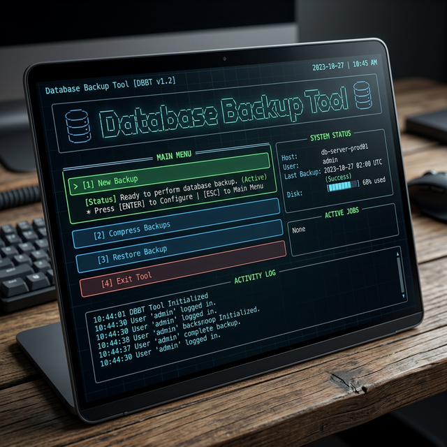
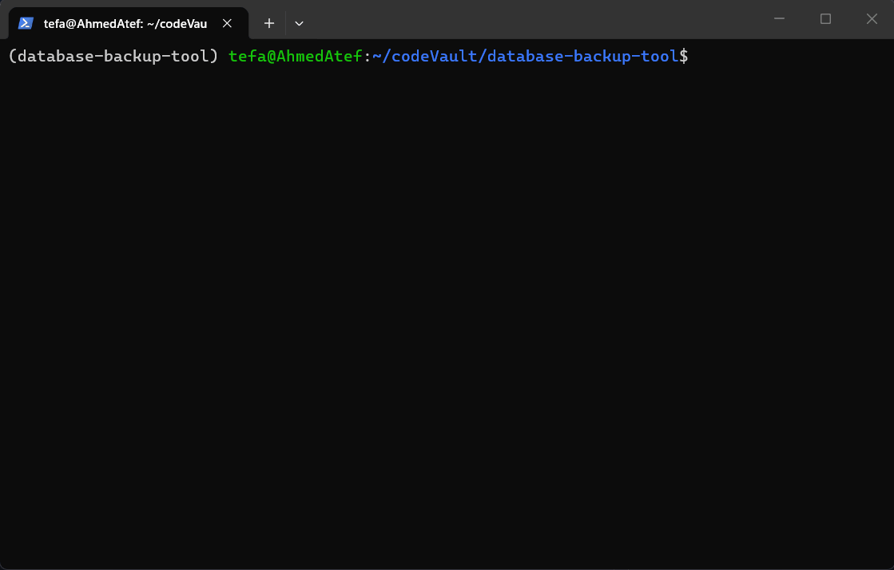

# 🗄️ Database Backup & Restore Tool



A powerful, modern terminal-based (TUI) application built with **Textual** for managing database backups and restores across multiple environments. Whether your database is local, in a Docker container, or on a remote server, this tool handles it with ease.

---

## 📺 Visual Overview


*A visual representation of the modern, responsive Terminal User Interface.*

---

## ✨ Features

- **🌐 Multi-Engine Support**: Seamlessly backup and restore **MySQL**, **PostgreSQL**, **MongoDB**, and **SQLite**.
- **🚀 Flexible Execution**:
  - **Local**: Direct execution on your host machine.
  - **Docker**: Execute inside local containers.
  - **SSH**: Remote execution on Linux servers via SSH.
  - **SSH + Docker**: Execute inside containers on remote servers.
- **📦 Smart Compression**: Built-in functionality to compress `.sql` dumps into `.tar.gz` archives to save space.
- **🔄 Seamless Restore**: Automated restore process that handles `.sql` files and auto-decompresses `.tar.gz` archives before restoring.
- **📊 User-Friendly TUI**: A premium Terminal User Interface with dynamic forms, notifications, and interactive menus.
- **📜 Robust Logging**: Comprehensive logging for every operation to track successes and troubleshoot failures.

---

## 🏗️ Architecture

The project follows a decoupled strategy-pattern architecture:

- **Executors**: Isolated environments where commands are run (Local, Docker, SSH).
- **Strategies**: Database-specific logic for backup and restore commands.
- **UI**: A reactive interface that communicates with the core logic via entry points.

---

## 🛠️ Installation

This project uses [uv](https://github.com/astral-sh/uv) for fast Python package management.

1. **Clone the repository**:
   ```bash
   git clone <repository-url>
   cd database-backup-tool
   ```

2. **Setup the environment**:
   ```bash
   uv venv
   source .venv/bin/activate  # On Windows: .venv\Scripts\activate
   uv sync
   ```

---

## 🚀 Usage

Start the application by running:

```bash
python main.py
```

### Main Menu Layout
The interface is divided into a structured layout for maximum efficiency:
1. **Header**: Displays the application title and current status.
2. **Main Navigation**: Sidebar or central menu for switching between Backup, Compression, and Restore modes.
3. **Dynamic Forms**: Sub-screens with context-aware inputs that change based on your selected "Executor Type" (e.g., showing Host/User/Port only for SSH).
4. **Activity Logs & Notifications**: Real-time feedback on your backup and restore operations via pop-up notifications and a dedicated log file.

---

## 📂 Project Structure

- `UI/`: Contains Textual screens (`Main Menu`, `Backup`, `Restore`, `Compression`).
- `core/`:
  - `backup/`: Implementation of database strategies and executors.
  - `compression/`: Logic for handling tarball archives.
  - `utils.py`: Logging and path management.
- `backups/`: Default directory where all backup files are stored.
- `logs/`: Application execution logs.

---

## ⚙️ Requirements

- Python 3.10+
- Appropriate client tools installed on the execution environment (e.g., `mysqldump`, `pg_dump`, `mongorestore`).
- Docker (if using Docker executor).
- SSH access (if using SSH executors).

---

## 📝 License

This project is open-source. See the `LICENSE` file for more details.
